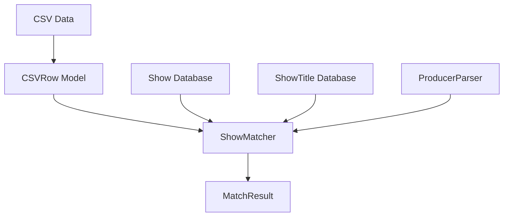
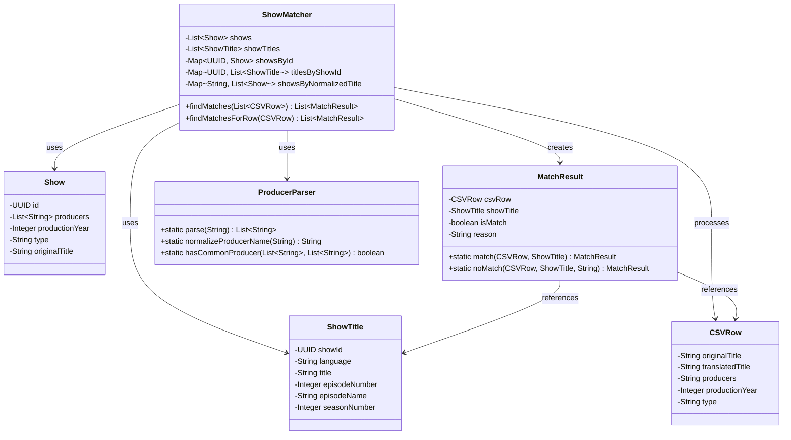

# System Architecture

## High-Level Design

The Show Matching System follows a service-oriented architecture with clear separation of concerns:

## Core Components

### ShowMatcher

The central component responsible for matching CSV rows against the show database:

- Indexes shows by ID and normalized title for efficient lookup
- Groups show titles by show ID for quick access
- Implements the matching algorithm
- Processes data in parallel for performance

### Data Models

- **Show**: Represents a show in the database with its metadata
- **ShowTitle**: Represents a title for a show in any language
- **CSVRow**: Represents a row from a CSV file to be matched
- **MatchResult**: Represents the result of a matching operation

### Utilities

- **ProducerParser**: Parses producer strings with different separators and normalizes producer names

## Design Patterns

The system implements several design patterns:

1. **Builder Pattern**: Used for creating complex objects like Show, ShowTitle, and CSVRow
2. **Immutable Objects**: All model classes use final fields and immutable collections
3. **Factory Methods**: Static factory methods for creating MatchResult objects
4. **Parallel Processing**: Parallel streams for efficient data processing

## Component Relationships

## Critical Implementation Paths

1. **Indexing**: Shows are indexed by normalized title during initialization
2. **Matching**: CSV rows are matched against shows using title containment, year, type, and producer matching
3. **Result Generation**: Match results are created for each successful match
4. **Filtering**: Only successful matches are returned in the final result
