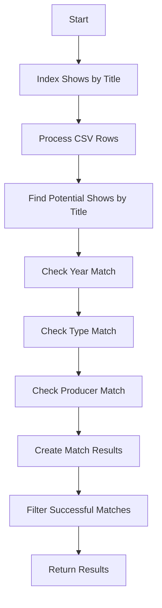

# Matching Algorithm

The Show Matching System uses a multi-criteria matching algorithm to identify shows from CSV data that match shows in the database.

## Algorithm Overview



## Matching Process

### 1. Indexing

Before matching begins, shows are indexed for efficient lookup:

```java
// Index shows by ID
this.showsById = shows.stream()
        .collect(Collectors.toMap(Show::getId, Function.identity()));

// Group titles by show ID
this.titlesByShowId = showTitles.stream()
        .collect(Collectors.groupingBy(ShowTitle::getShowId));

// Index shows by normalized title
this.showsByNormalizedTitle = new ConcurrentHashMap<>();
for (final Show show : shows) {
    final String normalizedTitle = normalizeTitle(show.getOriginalTitle());
    showsByNormalizedTitle.computeIfAbsent(normalizedTitle, k -> new ArrayList<>()).add(show);
}
```

### 2. Title Matching

The first step is to find potential show matches based on title:

```java
private List<Show> findPotentialShowsByTitle(CSVRow csvRow) {
    final List<Show> potentialShows = new ArrayList<>();
    
    // Check original title
    if (csvRow.getOriginalTitle() != null && !csvRow.getOriginalTitle().isBlank()) {
        potentialShows.addAll(findShowsByTitle(csvRow.getOriginalTitle()));
    }
    
    // Check translated title
    if (csvRow.getTranslatedTitle() != null && !csvRow.getTranslatedTitle().isBlank()) {
        potentialShows.addAll(findShowsByTitle(csvRow.getTranslatedTitle()));
    }
    
    return potentialShows.stream()
            .distinct()
            .collect(Collectors.toList());
}
```

Title matching uses a containment check rather than exact matching:

```java
private List<Show> findShowsByTitle(String title) {
    final List<Show> result = new ArrayList<>();
    final String normalizedTitle = normalizeTitle(title);
    
    // Direct lookup by normalized title
    final List<Show> directMatches = showsByNormalizedTitle.getOrDefault(normalizedTitle, List.of());
    result.addAll(directMatches);
    
    // Check if any show title contains this title
    for (final ShowTitle showTitle : showTitles) {
        final String normalizedShowTitle = normalizeTitle(showTitle.getTitle());
        
        // Check if either title contains the other
        if (normalizedShowTitle.contains(normalizedTitle) || normalizedTitle.contains(normalizedShowTitle)) {
            final Show show = showsById.get(showTitle.getShowId());
            if (show != null) {
                result.add(show);
            }
        }
    }
    
    return result.stream()
            .distinct()
            .collect(Collectors.toList());
}
```

### 3. Metadata Matching

For each potential show match, additional metadata is checked:

#### Year Matching

```java
private boolean isYearMatch(Integer csvYear, Integer showYear) {
    // If either year is null, consider it a match
    if (csvYear == null || showYear == null) {
        return true;
    }
    
    // Otherwise, years must be equal
    return csvYear.equals(showYear);
}
```

#### Type Matching

```java
private boolean isTypeMatch(String csvType, String showType) {
    // If either type is null, consider it a match
    if (csvType == null || showType == null) {
        return true;
    }
    
    // Otherwise, types must be equal (case-insensitive)
    return csvType.equalsIgnoreCase(showType);
}
```

### 4. Producer Matching

Producer matching requires parsing the raw producer string and checking for common producers:

```java
// Check producer match
final List<String> csvProducers = ProducerParser.parse(csvRow.getProducers());
if (!csvProducers.isEmpty() && !show.getProducers().isEmpty() && 
        !ProducerParser.hasCommonProducer(csvProducers, show.getProducers())) {
    continue;
}
```

### 5. Result Generation

For each successful match, a MatchResult is created for each title of the matching show:

```java
// If we get here, we have a match
// Find all titles for this show
final List<ShowTitle> matchingTitles = titlesByShowId.getOrDefault(show.getId(), List.of());

for (final ShowTitle title : matchingTitles) {
    results.add(MatchResult.match(csvRow, title));
}
```

## Title Normalization

Titles are normalized for comparison by:
1. Trimming whitespace
2. Converting to lowercase
3. Removing all non-alphanumeric characters

```java
private String normalizeTitle(String title) {
    if (title == null) {
        return "";
    }
    
    return title.trim()
            .toLowerCase()
            .replaceAll("[^a-z0-9]", ""); // Remove all non-alphanumeric characters
}
```

## Parallel Processing

The matching process uses parallel streams for efficient processing of large datasets:

```java
public List<MatchResult> findMatches(List<CSVRow> csvRows) {
    return csvRows.parallelStream()
            .flatMap(csvRow -> findMatchesForRow(csvRow).stream())
            .filter(MatchResult::isMatch)
            .collect(Collectors.toList());
}
```

## Match Confidence

The current implementation uses a binary match/no-match approach. A match is only considered successful if:

1. Titles contain each other (after normalization)
2. Years match (if both are non-null)
3. Types match (if both are non-null)
4. At least one producer is common (if both have producers)

This ensures high confidence in the matches, as required by the project specifications.
