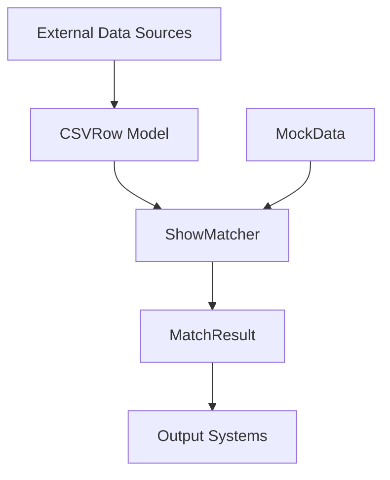

# Project Overview

## Purpose
Media content matching system that correlates shows across different data sources using similarity algorithms.

## Key Components

### Core Modules
- **Matching Engine** (`matcher` package) - Jaro-Winkler based title matching
- **Data Models** (`model` package) - Show metadata structures
- **CSV Integration** (`CSVRow` model) - External data mapping
- **Mock Data** (`data` package) - Development/testing dataset

### Architectural Flow

## Main Dependencies
- Java 17
- Gradle build system
- JUnit (testing)
