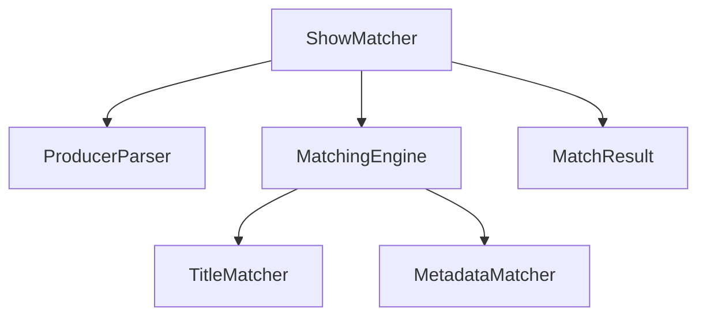

# System Patterns

## Architecture
- Core matching engine with pluggable matching strategies
- Data model with clear separation of concerns
- Service-oriented design for extensibility

## Key Technical Decisions
1. **Producer Parsing Strategy**:
   - Detect and parse producer strings with multiple separator characters
   - Normalize producer names for consistent matching

2. **Matching Algorithm**:
   - Title containment check (case-insensitive)
   - Exact match for non-null fields (year, type)
   - Partial match for producers (at least one overlap)
   - Null-aware comparisons for optional fields

3. **Performance Optimization**:
   - Pre-indexing of shows by normalized titles
   - Parallel stream processing
   - Caching of parsed producer lists

## Component Relationships

## Critical Implementation Paths
1. CSV row parsing and normalization
2. Show database indexing
3. Multi-criteria matching logic
4. Result confidence calculation
